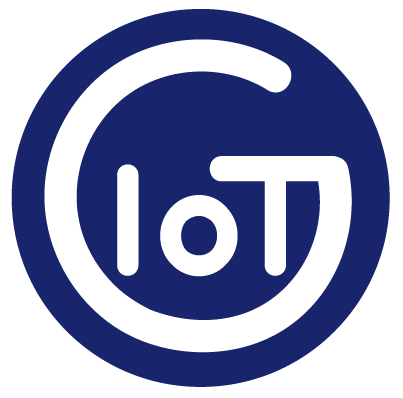

<a href="https://www.gotoiot.com/">
    
</a>

Embed IoT Core
==============

*Ayudaría mucho si apoyaras este proyecto con una ⭐ en Github!*

Este proyecto es una plataforma integral para el desarrollo de aplicaciones embebidas IoT que utiliza `Arduino` como framework de desarrollo y `PlatformIO` integrado en `Visual Studio Code` para manejar de manera simple y eficiente la compilación y linkeo del código, la administración y descarga de bibliotecas, la gestión de múltiples placas, la descarga de código, el debugging y mucho más. 

Además de brindarte un marco de trabajo para que puedas probar tus proyectos, viene cargado con varias aplicaciones de ejemplo que se pueden compilar y ejecutar fácilmente. Con esta plataforma podés probar diferentes tecnologías y comunicaciones desde un mismo repositorio, con un mismo esquema de trabajo y entendiendo una única documentación.

El objetivo del proyecto es facilitarte el desarrollo de aplicaciones embebidas para IoT, centralizar el código y la documentación, y probar ejemplos que realmente funcionan lo más rapido posible.

> Si bien se puede adaptar a distintas plataformas, está principalmente desarrollado para correr sobre alguna que posea el módulo `ESP32`.

## Comenzando 🚀

Esta sección es una guía con los pasos escenciales para que puedas poner en marcha el proyecto. Vas a necesitar una placa con el módulo `ESP32` o similar para esta parte.

<details><summary><b>Mira los pasos necesarios</b></summary>

### Instalar las dependencias

Este proyecto utiliza la herramienta `PlatformIO` (PIO) como una extensión dentro `Visual Studio Code` (VSCode) para realizar todas las tareas necesarias. Si bien PIO puede funcionar de manera independiente, al utilizarlo integrado dentro de VSCode podés combinar la potencia de ambas herramientas.

Para instalar VSCode en tu máquina te recomendamos hacerlo desde su documentacion oficial en [este link](https://code.visualstudio.com/download). Cuando tengas instalado VSCode, podés seguir la [guía de instalación paso a paso](https://www.gotoiot.com/pages/articles/platformio_vscode_installation/) de nuestra web donde te mostramos todos los detalles para instalar y configurar PIO en VSCode y correr un programa de ejemplo.

Una vez que puedas correr el ejemplo de la guía, podes continuar con la descarga del código.

### Descargar el código

Para descargar el código, lo más conveniente es que realices un `fork` de este proyecto a tu cuenta personal haciendo click en [este link](https://github.com/gotoiot/embed-iot-core/fork). Cuando tengas el fork a tu cuenta, descargalo con este comando (acordate de poner tu usuario en el link):

```
git clone https://github.com/USER/embed-iot-core.git
```

> En caso que no tengas una cuenta en Github podes clonar directamente este repo.

### Correr el programa por defecto

Para chequear que todo funcione correctamente vamos a compilar y ejecutar el programa por defecto. 

Como primera medida necesitas conectar la placa embebida a la PC para poder programarla. Luego tenés que ir a la extensión de PlatformIO dentro de VS Code en el menú lateral izquierdo, y en la sección `Quick Access` seleccioná `Miscellaneous->New Terminal`. Esto carga la herramienta dentro del scope de la terminal. 

Luego de abrir la terminal, desde la raíz del proyecto ejecutá este comando que compila el código, lo descarga a la placa y abre el monitor serie; todo en un mismo comando:

```
pio run -e default -t upload && pio device monitor
```

Cuando el programa inicie, el LED de la placa debería comenzar a blinkear y en la terminal serie deberías ver una salida como esta:

```
Welcome to Embed IoT Core - https://www.gotoiot.com
LED on
LED off
...
LED on
LED off
```

Si llegaste a este punto es porque todo está funcionando correctamente.

</details>

Continuá explorando el proyecto una vez que lo tengas funcionando.

## Información principal 🔍

En esta sección vas a encontrar la información para entender y configurar el proyecto.

<details><summary><b>Mira los detalles</b></summary>

### Ejecutar las aplicaciones existentes

Las aplicaciones se encuentran dentro del directorio `examples` y cada una está compuesta por un archivo de código fuente con extensión `.cpp` y un archivo `README.md` que describe cómo funciona.

El primer paso para correr una aplicación existente es que leas su README y te familiarices de manera general con el código.

Una vez que entiendas de qué se trata, copia el contenido del archivo `.cpp` del ejemplo, en el archivo `src/main.cpp`.

Luego cargá en el archivo `src/secrets.h` los datos sensibles que necesita la aplicación para correr. Los datos sensibles están detallados en el README de cada aplicación, y por lo general tenés que configurar datos como el ID del dispositivo, la contraseña de WiFi, las URLs de hosts, credenciales, etc.

Una vez que tengas el archivo `src/main.cpp` y `src/secrets.h` configurados adecuadamente continua con los pasos para descargar el código a la placa.

### Descargar el código a la placa

Cuando ya tengas el código listo para correr, conectá la placa a la PC para poder programarla. Luego tenés que ir a la extensión de PlatformIO dentro de VS Code en el menú lateral izquierdo, y en la sección `Quick Access` seleccioná `Miscellaneous->New Terminal` para cargar la herramienta dentro del scope de la terminal. 

Luego de abrir la terminal, desde la raíz del proyecto ejecutá este comando que compila el código, lo descarga a la placa y abre el monitor serie; todo en un mismo comando:

```
pio run -e default -t upload && pio device monitor
```

### Crear tus propias aplicaciones

Cuando quieras crear tu propia aplicación, deberías comenzar creando una nueva carpeta dentro del directorio `examples` que contenga un archivo con extensión `.cpp` y un archivo `README.md`. Es conveniente que realices una copia completa de un ejemplo existente para no comenzar de cero.

A medida que tu código tome forma y tengas la aplicación más definida, podés copiar el contenido del ejemplo al archivo `src/main.cpp` y configurar en el archivo `src/secrets.h` los datos sensibles que tu aplicación necesite. 

Luego podés comenzar un proceso de iteración compilando y ejecutando código en la placa - como está detallado en la sección de descargar el código a la placa - hasta que funcione correctamente. 

Cuando te sientas conforme con el funcionamiento escribí en el archivo README.md de tu aplicación todos los detalles necesarios para correrla. También agregá tu aplicación a la lista de aplicaciones con los detalles principales y finalmente versioná tus cambios. 

De manera opcional podés leer la información complementaria sobre cómo enviarnos tu aplicación para que la agreguemos al proyecto.

### Agregar una biblioteca al proyecto

La gestión de las bibliotecas se hace a través de la herramienta PlatformIO. Esta herramienta te permite gestionar de manera extremadamente simple el agregado de bibliotecas de terceros para realizar alguna acción específica. Los pasos son los siguientes:

1. Abrí el Home de PlatformIO desde el menú lateral izquierdo, y seleccionado `Open` en la sección `Quick Access -> Pio Home`.
2. Accedé a la sección `Libraries` en la Home de PIO y buscá la biblioteca que querés instalar.
3. Seleccioná la que quieras agregar y en ventana de la biblioteca presioná el botón `Add to Project`.
4. En el popup emergente seleccioná este proyecto `embed-iot-core` y presioná `Add`. Luego de unos instantes la biblioteca será añadida al proyecto.
5. Revisá que en el directorio `.pio/libdeps` se encuentre una carpeta con la biblioteca que acabás de instalar.
6. Revisá que en el archivo `platformio.ini` en la sección `lib_deps` se haya agregado una nueva línea con la biblioteca que acabás de instalar.
7. Volvé al gestor de bibliotecas y en la parte superior, en el tab `Installed` vas a encontrar las bibliotecas que instalaste separadas por proyecto. Accediendo a la biblioteca instalada vas a tener info sobre ejemplos y cómo incluirla en el proyecto.

Es conveniente que leas nuestro artículo de [uso de PlatformIO en Visual Studio Code](https://www.gotoiot.com/pages/articles/platformio_vscode_installation/) para que tengas más detalles sobre este y otros temas para usar PlatformIO en VSCode.

### Configuraciones de PlatformIO

Toda la configuración del proyecto se encuentra en el archivo `platformio.ini`. El proyecto se focaliza en placas que tengan el módulo ESP32 y que utilizan el framework Arduino. A continuación podés encontrar algunos detalles.

* Cada sección entre corchetes `[]` representa un bloque. 
* El bloque `[env]` representa una configuración que es compartida entre todos los ambientes.
* El bloque `[default]` sirve para correr un entorno por defecto con la placa nodemcu-esp32s.
* Podés agregar otras placas soportadas yendo a la [documentación oficial de PlatformIO](https://docs.platformio.org/en/latest/boards/index.html).

</details>

## Información complementaria 📚

En esta sección vas a encontrar información que te va a servir para tener un mayor contexto.

<details><summary><b>Lee esta info</b></summary>

### Organización del proyecto

La organización del proyecto es simple y tiene este aspecto:

```sh
├── .pio            # estructura de directorios y archivos que usa PlatformIO
├── .vscode         # estructura de directorios y archivos que usa Visual Studio Code
├── doc             # doc general del proyecto, imagenes, manuales, etc.
├── examples        # ejemplos de aplicaciones separadas por afinidad (mqtt, coap, ble, etc.)
├── lib             # directorio donde podés guardar tus bibliotecas privadas
├── src             # donde se aloja el codigo fuente a compilar
|   ├── main.cpp    # archivo principal que contiene el codigo de la aplicacion
|   └── secrets.h   # archivo para guardar datos sensibles (contraseñas, hosts, etc.)
├── platformio.ini  # archivo de configuracion de compilacion (board, framework, libs, etc.)
├── README.md       # este archivo
└── LICENCE         # licencia del proyecto
```

### Lista de aplicaciones

Las aplicaciones están ordenadas por afinidad y todas las que existen hasta el momento se listan aca.

* **`MQTT`**
    * **[`Pressure measurer`](https://github.com/gotoiot/embed-iot-core/tree/master/examples/mqtt/pressure_measurer)**: Es una demostración completa de comunicación bidireccional MQTT. Tiene la capacidad de enviar y recibir topics MQTT. Su funcionalidad principal radica en tomar mediciones "fake" de un sensor de presión y enviarlas en un topic determinado. El tiempo en que envía tales mediciones puede ser modificado enviando un topic de configuración desde otro cliente MQTT. Accede al [README del proyecto](https://github.com/gotoiot/embed-iot-core/tree/master/examples/mqtt/pressure_measurer) para ver todos los detalles.<br><br>
    * **[`Remote light system`](https://github.com/gotoiot/embed-iot-core/tree/master/examples/mqtt/remote_light_system)**: es una demostración abarcativa de las capacidades que tiene un dispositivo embebido para comunicarse por MQTT. Es capaz de enviar y recibir topics, enviar un topic al iniciar para dar aviso al sistema, así como también avisar automáticamente si sufre una desconexión (mensaje conocido como LWT). Su funcionalidad principal es actuar como un dispositivo de iluminación dentro de un sistema integral de luces que se controla de manera remota. Puede recibir un topic para controlar individualmente el LED de cada dispositivo asi como también se pueden controlar un grupo de dispositivos al mismo tiempo haciendo uso de la capacidad de broadcast de MQTT. También es capaz de informar el estado del dispositivo general, y el estado del LED. Esto puede permitir a sistemas remotos administrar y tener un control sobre el estado de cada dispositivo dentro de la red. Accede al [README del proyecto](https://github.com/gotoiot/embed-iot-core/tree/master/examples/mqtt/remote_light_system) para ver todos los detalles.
* **`BLE`**
    * **[`iBeacon Broadcaster`](https://github.com/gotoiot/embed-iot-core/tree/master/examples/ble/ibeacon_broadcaster)**: Es una demostración completa de un broadcaster de tramas iBeacons. El dispositivo hace broadcasting de la trama iBeacon durante un tiempo configurable en milisegundos y luego entra en modo deep sleep por un tiempo configurable en segundos. El valor que se transmite en cada trama iBeacon está determinado por las configuraciones que se pueden realizar desde el archivo `src/secrets.h`. Accede al [README del proyecto](https://github.com/gotoiot/embed-iot-core/tree/master/examples/ble/ibeacon_broadcaster) para ver todos los detalles.<br><br>
* **`CoAP`**
    * **[`CoAP Server`](https://github.com/gotoiot/embed-iot-core/tree/master/examples/coap/coap_server)**: : Este proyecto es una demostración completa de un servidor CoAP que habilita diferentes recursos (endpoints) que un cliente CoAP puede encuestar. Como está pensado para funcionar en un dispositivo como un ESP32 - que generalmente vienen integrados con un boton y un LED -, esta aplicación crea un recurso asociado al LED onboard de la placa para poder controlarlo y otro asociado al botón, de manera tal que se puede encuestar el estado del mismo. Además, implementa el recurso `well-known` que permite descubrir los recursos que implementa el servidor. Accede al [README del proyecto](https://github.com/gotoiot/embed-iot-core/tree/master/examples/coap/coap_server) para ver todos los detalles.<br><br>
    

### Agregar tu aplicación a este proyecto

Si estuviste trabajando en una aplicación propia y crees que estaría bueno sumarla al proyecto, vamos a estar más que deseosos de agregarla. 

En Goto IoT hacemos mucho esfuerzo en entregar la mejor calidad posible de código, que sea claro, autoexplicativo y que tenga una buena documentación para que otra persona pueda utilizarla. Por eso te proponemos que sigas los siguientes lineamientos:

* Que sigas las guías de estilo de las aplicaciones publicadas, es decir cómo nombrar las variables globales, locales, funciones, constantes y demás. Podés leer más al respecto en [nuestra wiki](https://github.com/gotoiot/gotoiot-doc/wiki).
* Que hagas un buen README con toda la información necesaria y bien redactada para que otra persona pueda utilizarla sin conocimientos previos.
* Agregar tu nombre y usuario de Github al archivo `Contribuitors.md`.
* Que nos envíes un pull request con tus cambios. Si no sabés cómo, podés leer el archivo [Contribuir.md](https://github.com/gotoiot/gotoiot-doc/wiki/Contribuir) de nuestra wiki donde te explicamos todos los pasos.

En el mundo del software libre la colaboración lo es todo y te agradecemos que sientas interés por colaborar con nosotros para que juntos podamos formar la mejor comunidad de IoT.

</details>

## Tecnologías utilizadas 🛠️

Estas son las tecnologías más importantes utilizadas.

<details><summary><b>Mira la lista completa de tecnologías</b></summary><br>

* [PlatformIO](https://platformio.org/n) - Plataforma para desarrollar sistemas embebidos.
* [Visual Studio Code](https://code.visualstudio.com/) - Popular IDE de desarrollo para múltiples plataformas.
* [Arduino](http://arduino.cc/) - Framework para desarrollo de sistemas embebidos.
* [Espressif ESP32](https://www.espressif.com/en/products/socs/esp32) - SoC con WiFi y Bluetooth integrado ampliamente utilizado en IoT.

</details>

## Contribuir 🖇️

Si estás interesado en el proyecto y te gustaría sumar fuerzas para que siga creciendo y mejorando, podés abrir un hilo de discusión para charlar tus propuestas en [este link](https://github.com/gotoiot/embed-iot-core/issues/new). Así mismo podés leer el archivo [Contribuir.md](https://github.com/gotoiot/gotoiot-doc/wiki/Contribuir) de nuestra Wiki donde están bien explicados los pasos para que puedas enviarnos pull requests.


## Autores 👥

Las colaboraciones principales fueron realizadas por:

* **[Agustin Bassi](https://github.com/agustinBassi)**: Ideación, puesta en marcha y mantenimiento del proyecto.

También podés mirar todas las personas que han participado en la [lista completa de contribuyentes](https://github.com/embed-iot-core/contributors).


## Sobre Goto IoT 📖

Goto IoT es una plataforma que publica material y proyectos de código abierto bien documentados junto a una comunidad libre que colabora y promueve el conocimiento sobre IoT entre sus miembros. Acá podés ver los links más importantes:

* **[Sitio web](https://www.gotoiot.com/):** Donde se publican los artículos y proyectos sobre IoT. 
* **[Github de Goto IoT:](https://github.com/gotoiot)** Donde están alojados los proyectos para descargar y utilizar. 
* **[Comunidad de Goto IoT:](https://groups.google.com/g/gotoiot)** Donde los miembros de la comunidad intercambian información e ideas, realizan consultas, solucionan problemas y comparten novedades.
* **[Twitter de Goto IoT:](https://twitter.com/gotoiot)** Donde se publican las novedades del sitio y temas relacionados con IoT.
* **[Wiki de Goto IoT:](https://github.com/gotoiot/doc/wiki)** Donde hay información de desarrollo complementaria para ampliar el contexto.

## Muestas de agradecimiento 🎁

Si te gustó este proyecto y quisieras apoyarlo, cualquiera de estas acciones estaría más que bien para nosotros:

* Apoyar este proyecto con una ⭐ en Github para llegar a más personas.
* Sumarte a [nuestra comunidad](https://groups.google.com/g/gotoiot) abierta y dejar un feedback sobre qué te pareció el proyecto.
* [Seguirnos en twitter](https://github.com/gotoiot/doc/wiki) y dejar algún comentario o like.
* Compartir este proyecto con otras personas.

## Licencia 📄

Este proyecto está bajo Licencia ([MIT](https://choosealicense.com/licenses/mit/)). Podés ver el archivo [LICENSE.md](LICENSE.md) para más detalles sobre el uso de este material.

---

**Copyright © Goto IoT 2021** - [**Website**](https://www.gotoiot.com) - [**Group**](https://groups.google.com/g/gotoiot) - [**Github**](https://www.github.com/gotoiot) - [**Twitter**](https://www.twitter.com/gotoiot) - [**Wiki**](https://github.com/gotoiot/doc/wiki)
