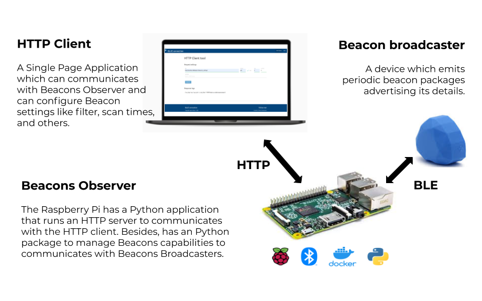

# Open source Bluetooth Beacons Platform

Author: Agustin Bassi - 2020

## 

## Table of Contents

* [Platform Introduction](#platform-introduction)
* [Install dependencies](#install-dependencies)
* [Run the application](#run-the-application)
* [Contributing](#contributing)
* [License](#license)

## 

## Platform Introduction

The goal of this project is to create an open source Bluetooth LE Beacons Platform to be used in any project.

The platform consists in several sub-application:

* **BLUE Connection - Beacons Observer**: An HTTP REST API with beacon packages scanning features, which can reads different beacon types. By this module you can configure filters, scan time, turn on/off the beacon scanner, and get different beacon-related information like the nearest beacons, the list of beacon read, and many others.  
To get more information, please refer to its [README.md](./beacons-observer/README.md) file.
* **BLUE Connection - Content Management System**: In progress.  
To get more information, please refer to its [README.md](#) file.
* **BLUE Connection - HTTP Client**: An HTTP Client that can executes different HTTP Request to Beacon Scanner API. There, the user can configure Beacon filters, scan time, turn on/off the scanner and other ones.  
To get more information, please refer to its [README.md](./http-client/README.md) file.
* **BLUE Connection - Beacons Broadcasters**: A bunch of utilities for different platforms to generate beacon packages from devices like ESP32, Linux Systems or event any compatible smartphone.
To get more information, please refer to its [README.md](./beacons-broadcasters/README.md) file.

In the figure below is a description of the platform modules and how they interact each others.

## 

## Install dependencies

The application needs the next dependencies.

* Python 3.x
* Docker (optional)
* Docker-compose (optional)

To install Python refer to [official documentation](https://python.org) to find installation procedure in each operating system.

To install Docker refer to [official documentation](https://docs.docker.com/get-docker/) to find installation procedure in each operating system.

To install Docker-Compose refer to [official documentation](https://docs.docker.com/compose/install/) to find installation procedure in each operating system.

## 

## Run the application

To run the application the next requirements are needed:

* Get running the beacons-observer to be able to scans beacon packages. To run the observer follow the steps in its [README.md](./beacons-observer/README.md) file.
* Get running the HTTP client to interact with the beacon observer and configure settings like scan time, beacon filter, and many others. In its [README.md](./http-client/README.md) file there is a detailed information of how to run the client and communicates with beacon-scanner. To be able to connect with the scanner, it must be running and the client must connect to its address in the way like [http://host:port/api/v1/](http://host:port/api/v1/).
* Get running a beacon broadcaster in some of next ways:
    * Real iBeacon broadcaster (any commercial beacon like Estimotes, Kontakt, or similar).
    * Embedded system like ESP32 with integrated Bluetooth LE.
    * Beacon emulator application installed in a Raspberry Pi or PC with Bluetooth LE compatible version.
    * Smartphone application capable of emits beacons packages.

## 

## Contributing

Pull requests are welcome. For major changes, please open an issue first to discuss what you would like to change.

## 

## License

This project is licensed under the GPLV3 License.

If you find it useful please helpme with follow to my Github user and mark this project with a Star. This will animate me to continue contribuiting with the great open source community.