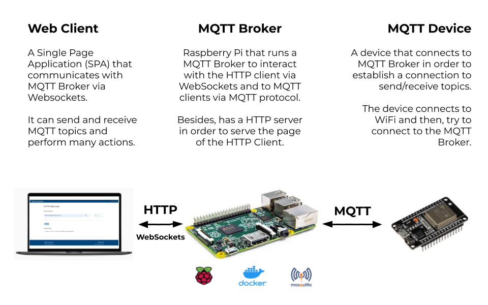

# Open source MQTT Platform

Author: Agustin Bassi - 2020

## 
## Table of Contents


* [Platform Introduction](#platform-introduction)
* [Install dependencies](#install-dependencies)
* [Run the application](#run-the-application)
* [Want to help?](#want-to-help-?)
* [License](#license)

## 
## Platform Description

The goal of this project is to create an open source MQTT Platform to be used as a part of an IoT system, based on mqtt protocol.

The platform consists in several sub-application described below:

* **MQTT Broker**: Raspberry Pi that runs a MQTT Broker to interact with the HTTP client via WebSockets and to MQTT clients via MQTT protocol. Besides, has a HTTP server in order to serve the page of the HTTP Client.
* **Web Client**: A Single Page Application (SPA) that communicates with MQTT Broker via Websockets. It can send and receive MQTT topics and perform many actions. The code use whole MQTT connection features from [this project](https://github.com/jpmens/simple-mqtt-websocket-example).
* **MQTT Client**: A device that connects to MQTT Broker in order to establish a connection to send/receive topics. The device connects to WiFi and then, try to connect to the MQTT Broker. 

All of this parts are well described in the [Project Wiki](https://github.com/agustinBassi-others/mq-connection/wiki). Please, refer to it in order to get all required information.

In the figure below there is a description of the platform modules and how they interact each others.



## 
## Install dependencies


The application runs over Raspberry Pi 3+ (or Linux system based in Debian). To install Raspberry Pi OS refer to [official documentation](https://www.raspberrypi.org/documentation/installation/installing-images/).

The platform needs the next dependencies.

* Docker & Docker-Compose (installation steps in [this link](https://devdojo.com/bobbyiliev/how-to-install-docker-and-docker-compose-on-raspberry-pi)).

Reached this point you can proceed running the project.

## 
## Run the application

Once dependencies are installed in the Raspberry Pi do the next steps.

1. Download the platform code (this repository) with the next command.

```
git clone https://github.com/agustinBassi-others/mq-connection.git
cd mq-connection/
```

2. Start the MQTT Broker and the HTTP server with the next command.

```
docker-compose up
```

3. Run the HTTP Client. If the platform is running by managing the Raspberry Pi directly with mouse and keyboard go to [http://localhost:5001/](http://localhost:5001/) to open the client. If the platform is running by managing the Raspberry Pi via SSH go to [http://raspberri_pi_ip:5001/](http://raspberri_pi_ip:5001/) to open the client.

## 
## Want to help?

Pull requests are welcome. For major changes, please open an issue first to discuss what you would like to change.

If someone want to helpme, every bit of effort will be appreciated. In [this link](https://github.com/agustinBassi-others/mq-connection/projects/1) there is the project status board. You can take any card you want (or propose one) from the ToDo list and start to work.

If you find it useful please helpme following my Github user and give to this project a Star. This will animate me to continue contribuiting with the great open source community.

## 
## License

This project is licensed under the GPLV3 License.

