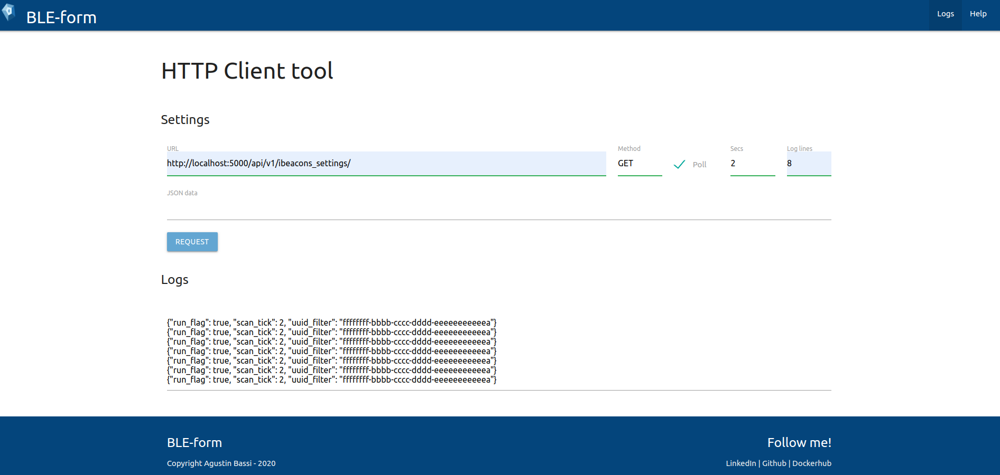

# BLE-form HTTP Client

Author: Agustin Bassi - 2020

## Description

This single web application is an HTTP Client that can execute different HTTP Methods, like GET, POST, PUT, sending request to differents hosts. In the image above there is a view of application working.

  

## Use BLE-form HTTP Client

For usage the application you must consider the next instruction:

* `URL`: Put any HTTP resource you know that exists. *
* `Method`: Select one of supported HTTP Methods: GET, PUT, POST. *
* `Poll`: Select/Unselect checkbox for execute polling request. Only supported for HTTP requests.
* `Secs`: The secconds that polling request will be executed. Only supported when `Poll` is selected.
* `Log lines`: Numeric values for show log. Only takes relevance when poll is enabled.  

## Run BLE-form HTTP Client

To run the app just double-click on `index.html` file. It will open the SPA. 

Once you are on it just execute the HTTP request you want, set request settings (optional) and add request data in JSON format (only needed for POST & PUT methods).  

## Contributing

Pull requests are welcome. For major changes, please open an issue first to discuss what you would like to change.

If you find it useful please helpme with follow to my Github user and a Star project, it will animate me to continue contribuiting with the great open source community.

## Licence

GPLV3
