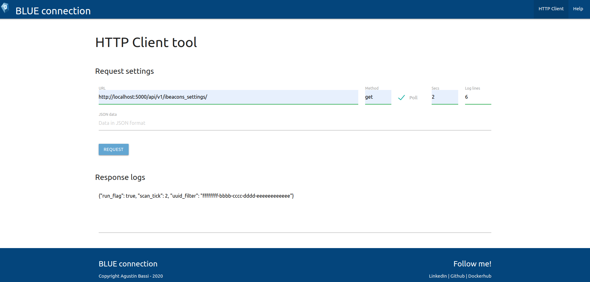

# HTTP Client


Author: Agustin Bassi - 2020

## 

## Description


This SPA (single page application) is an HTTP Client that can execute different HTTP Methods, like GET, POST, PUT.

Although it is specially designed to communicates directly with beacons-observer backend it can communicates to differents hosts. In the image below there is a view of application working.

  

## 

## HTTP Client usage

For use the application you must consider the next instructions:

* `URL`: Put any HTTP resource you know exists (required).
* `Method`: Select one of supported HTTP Methods: GET, PUT, POST (required).
* `Poll`: Select/Unselect checkbox for execute polling request. Only supported for HTTP GET requests.
* `Secs`: The seconds that polling request will be executed. Only supported when `Poll` is selected.
* `Log lines`: Numeric values for show log. Only takes relevance when poll is enabled.  

## 

## Run HTTP Client


There are two possible ways to execute the HTTP Client. Once the HTTP client is running, perform a request, set request settings (optional) and add request data in JSON format (only needed for POST & PUT methods) to test it.


### Method 1: Run the script to serve it (by Docker container)


This is the prefereable method because the client is served by HTTP, so it can be executed from any machine with network access to the server. To run the HTTP server, execute the `serve_http_client` as follows:

```
./serve_http_client.sh "$PWD" 8000
```

Where `"$PWD"` is this directory and `8000` the port where the client will be served.


### Method 2: Run the HTML file directly

To run the app just double-click on `index.html` file. It will open the SPA. 

## 

## Contributing


Pull requests are welcome. For major changes, please open an issue first to discuss what you would like to change.

## 

## Licence

This project is licensed under the GPLV3 License.

If you find it useful please helpme with follow to my Github user and mark this project with a Star. This will animate me to continue contribuiting with the great open source community.

